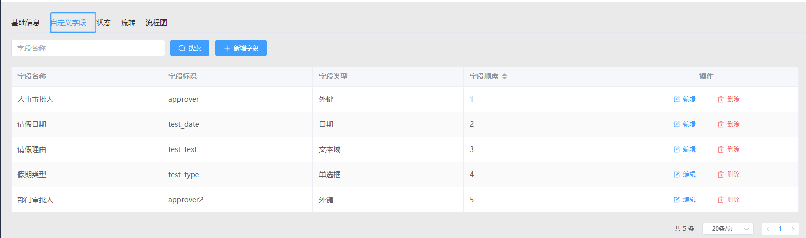
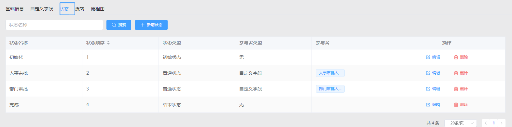
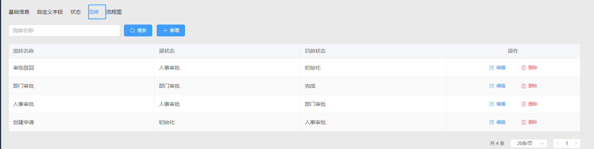
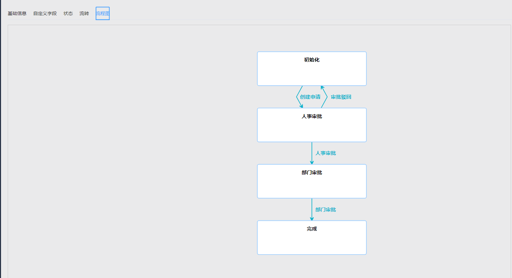
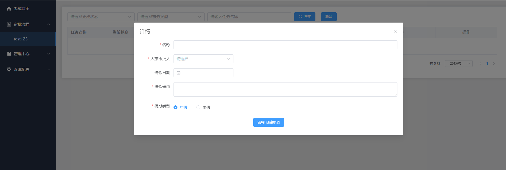

## 该项目前端使用 Vue3 + Vite + Element-plus + Windicss, 后端使用Django + DRF + SimpleJWT

# 启动项目： 

- - -
## 1. BackEnd:
### 安装MySQL

```angular2html
1.  Create database: 

CREATE DATABASE IF NOT EXISTS workflow_api default charset utf8mb4 COLLATE utf8mb4_general_ci;

2. Create user: workflow

CREATE USER workflow@'%' IDENTIFIED BY 'pass1234';
GRANT ALL PRIVILEGES ON *.* TO 'workflow'@'localhost';
FLUSH PRIVILEGES;
```
### 安装 < python 3.11

### 安装依赖：
```angular2html
pip install -r requirements.txt
```

### 数据库迁移
```angular2html
python manage.py migrate
```

### 创建用户
```angular2html
python manage.py createsuperuser
```

### 启动 BackEnd Server
```angular2html
python manage.py runserver
```


- --

## 2. FrontEnd:

### 安装Nodejs > 17.5

### 安装依赖：
```angular2html
cd ops_frontend
npm install
```

### 启动前端
```angular2html
npm run dev
```

### 访问：
```angular2html
http://localhost:5173/
```


# 操作演示： 

- - -
### 1. 编辑自定义字段:



### 2. 编辑自定义状态:



### 3. 编辑自定义流转方式:



### 4. 流程图预览:



### 5. 刷新页面后显示新标签页:
